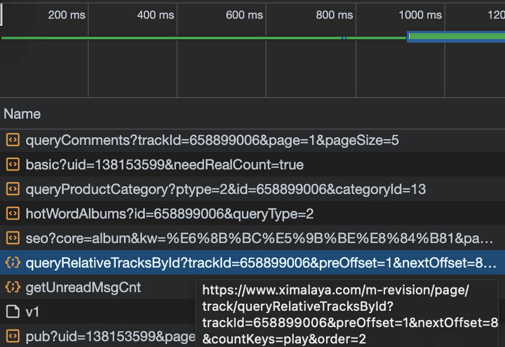

# xmly(Ximalaya)-downloader

## Requirements

- Node.js

## How to use

1. open any one of the audio.

1. find some link like below 

1. right click and copy cURL

```bash
https://www.ximalaya.com/m-revision/page/track/queryRelativeTracksById?trackId=<id>&preOffset=10000&nextOffset=0&countKeys=play&order=2
```

1. modify url's `preOffset` parameter to the number of audio per album. `preOffset` means load how many audios.

1. open `terminal`, paste and add `> xxx.json`

1. run `node app.js <xxx.json>`
