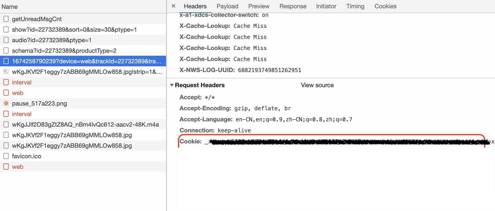

# xmly(Ximalaya)-downloader

## Requirements

- Node

- Python3

- Instant Data Scraper

## How to use?

If you are outside China, please log in to your Ximalaya account and export the cookie to the terminal environment by typing `export XMLY='<your cookie>'`. If you are using Chrome, you can obtain the cookie by following the steps below:

Download chrome extension [`Instant Data Scraper`](https://chrome.google.com/webstore/detail/instant-data-scraper/ofaokhiedipichpaobibbnahnkdoiiah), get all urls and titles as csv file, Only keep `text href` and `title` column.

- Install the Chrome extension Instant Data Scraper.
- Use the extension to extract all the URLs and titles of the content you want as a CSV file.
- In the CSV file, only keep the text href and title columns.
- To use the downloader, follow these steps:

    1. Run `make` in the command line.
    1. Put the CSV file and app.py in the same folder.
    1. Run `python3 app.py <parsed file path(xx.csv)>`. If you want to add an index for some album, add the flag `-i`.
